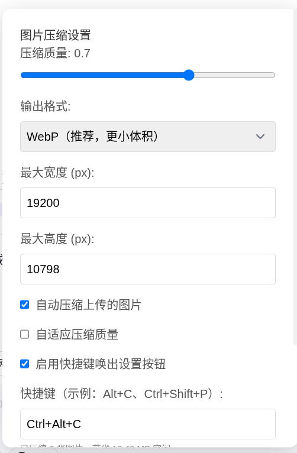

# AI 网站上传图片智能压缩脚本 / AI Website Upload  Image Compressor 

一款专为 AI 聊天平台设计的油猴（Tampermonkey）脚本，**自动压缩上传的图片**，节省流量、加快上传速度，并支持高度自定义。

---

## ✨ 功能亮点

- 🖼️ **自动压缩图片**：上传前自动将图片压缩为 WebP 或 JPEG，体积更小、加载更快。
- 🌐 **多平台支持**：完美适配以下主流 AI 聊天网站：
  - [Qwen Chat](https://chat.qwen.ai/)
  - [Z.AI](https://chat.z.ai/)
  - [Google Gemini](https://gemini.google.com/)
  - [DeepSeek Chat](https://chat.deepseek.com/)
- ⚙️ **灵活设置**：
  - 自定义压缩质量、最大分辨率、输出格式（WebP / JPEG）
  - 开启/关闭自动压缩、自适应质量
- 🎯 **便捷交互**：
  - 悬浮设置按钮（可拖动位置）
  - **双击隐藏按钮**（桌面 & 移动端均支持）
  - **自定义快捷键唤出按钮**（如 `Alt+C`，可关闭）
- 📊 **压缩统计**：记录已压缩图片数量与节省的流量
- 💾 **持久化配置**：所有设置保存在浏览器 `localStorage` 中，重启不失效

---
## 📸 使用示例

### 1. 悬浮设置按钮（默认位于右侧中部）
可拖动调整位置，双击按钮隐藏，默认快捷键 `Alt + C` 唤出。

---

### 2. 设置面板（支持滚动 & 自定义）
可调整压缩质量、格式、分辨率，并启用/禁用快捷键。

---
## 🛠 安装方式

1. 安装 [Tampermonkey](https://www.tampermonkey.net/) 浏览器扩展（Chrome / Edge / Firefox 等均支持）
2. 点击以下链接安装脚本：
   - [Greasy Fork 安装 AI 图片智能压缩助手](https://greasyfork.org/zh-CN/scripts/553468-ai-%E7%BD%91%E9%A1%B5%E5%9B%BE%E7%89%87%E4%B8%8A%E4%BC%A0-%E5%8E%8B%E7%BC%A9)
   - 或手动创建脚本，粘贴 。[完整脚本](https://github.com/JustDoIt166/AI-Upload-Image-Compressor/blob/main/script.js)
3. 刷新目标网站（如 chat.qwen.ai），右上角将出现 🖼️ 设置按钮

---

## ⌨️ 快捷键（默认）

- **`Alt + C`**：当设置按钮被隐藏时，按此组合键可重新显示  
  > 可在设置面板中修改或关闭此功能

---

## 🖥️ 移动端支持

- 双击按钮即可隐藏（通过 `touchstart` 模拟双击，兼容 iOS / Android）
- 快捷键功能在无物理键盘的设备上自动忽略，不影响使用

---

## 🔒 隐私与安全

- 所有图片压缩均在**浏览器本地完成**，**不上传任何数据到服务器**
- 使用 `OffscreenCanvas` + `Web Worker` 实现高效、无阻塞压缩
- 无网络请求、无遥测、无广告

---

## 📜 许可证

本项目采用 [MIT License](LICENSE) 开源。

---

## 💬 反馈与建议

欢迎提交 Issue 或 PR！
